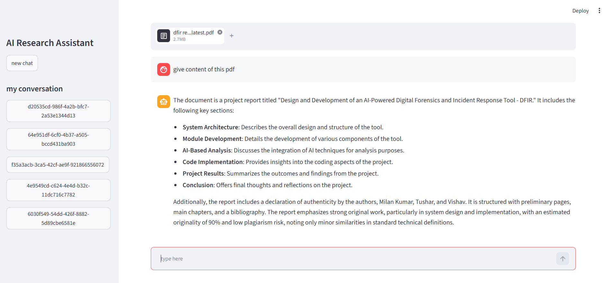
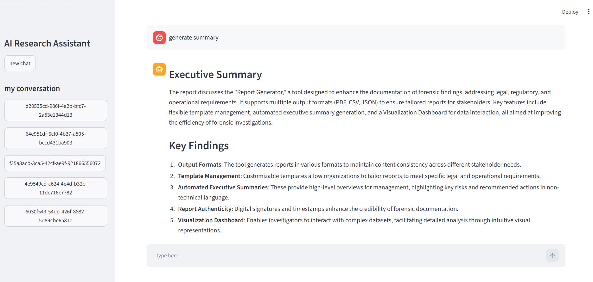
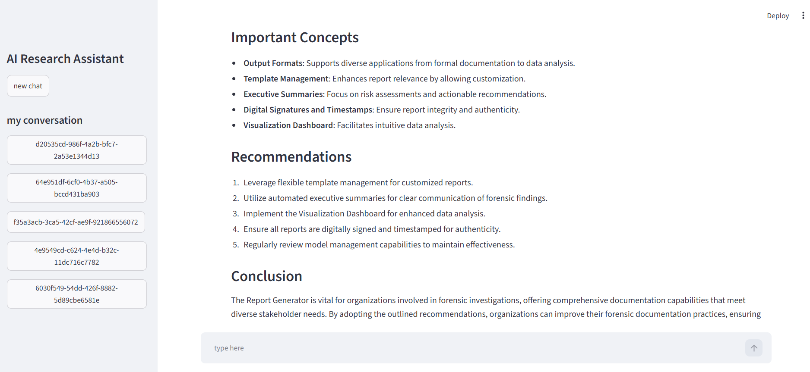

# 📚 AI Research Assistant with RAG

An AI-powered Research Assistant built using **LangGraph**, **LangChain**, and **OpenAI GPT-4o-mini**. The application allows users to upload PDF documents, ask questions about them, generate research reports, and search the web for recent information—all within a conversational interface.

## 🚀 Features

- 📄 Upload PDF documents
- 💬 Ask questions about uploaded PDFs
- 🧠 Retrieval-Augmented Generation (RAG)
- 📑 Automatic report generation
- 🌐 Web search for latest information
- 🔄 Tool Calling with LangGraph
- 💾 Persistent conversation memory using SQLite
- 🗂 Multiple chat sessions
- ⚡ Interactive Streamlit UI

# Tech Stack

- Python
- Streamlit
- LangChain
- LangGraph
- OpenAI GPT-4o-mini
- OpenAI Embeddings
- ChromaDB
- SQLite
- DuckDuckGo Search
- PyPDFLoader

# Project Workflow

1. Upload a PDF.
2. The document is split into chunks.
3. Embeddings are generated.
4. Chunks are stored in Chroma Vector Database.
5. User asks a question.
6. LangGraph agent decides which tool to call.
7. Retrieved context is sent to the LLM.
8. AI generates the final answer.
9. Conversation history is stored in SQLite.


# Tools Used

### 📄 RAG Tool

- Answers questions from uploaded PDFs.
- Retrieves relevant chunks using semantic search.

### 📑 Report Tool

- Generates a structured report from the uploaded document.

### 🌍 Search Tool

- Searches the web for latest news and current events.

# LangGraph Workflow

START
   │
   ▼
Chatbot
   │
Need Tool?
   │
  Yes
   │
   ▼
Tool Node
   │
   ▼
Selected Tool
   │
   ▼
Chatbot
   │
   ▼
END

# Key Features

- Retrieval-Augmented Generation (RAG)
- Tool Calling
- StateGraph Workflow
- ToolNode
- Persistent Chat Memory
- Multi-thread Conversations
- Semantic Search
- PDF Question Answering
- AI Report Generation


## 🖼️ Screenshots

### 🏠 Home Page


---

### 📄 Upload PDF & Question Answering




### 📑 Research Report Generation




---

### 🌐 Web Search


---

# Folder Structure
.
├── app.py
├── rag.py
├── research_langgraph.p
├── project_db
└── README.md

# Installation

```bash
git clone <repository-url>

cd AI-Research-Assistant
```

Create virtual environment

```bash
python -m venv venv
```

Activate environment

Windows

```bash
venv\Scripts\activate
```

Create a `.env` file

```
OPENAI_API_KEY=your_api_key
```

Run the application

```bash
streamlit run app.py
```

# Future Improvements

- Authentication
- Multi-PDF support
- Citation generation
- Deployment using Docker
- Cloud deployment

# Skills Demonstrated

- Generative AI
- LangChain
- LangGraph
- Retrieval-Augmented Generation (RAG)
- Vector Databases
- OpenAI Embeddings
- Tool Calling
- AI Agents
- Fast LLM Applications
- Semantic Search
- Prompt Engineering
- Streamlit
- SQLite

# Author

**Milan Kamboj**

B.Tech CSE | GenAI Developer | Agentic AI Enthusiast
